# Discord Clone - Class Diagram

This document contains the UML Class Diagram for the Discord Clone project, showing the object-oriented structure and relationships between classes.

## Class Diagram

```mermaid
classDiagram
    %% User Hierarchy (Inheritance)
    class User {
        -String userId
        -String username
        -String hashedPassword
        -boolean isOnline
        -Date lastSeen
        -List~String~ friendList
        -List~String~ joinedServers
        -String currentServer
        +User(username, hashedPassword)
        +String getUserId()
        +String getUsername()
        +void setUsername(String)
        +boolean isOnline()
        +void setOnline(boolean)
        +List~String~ getFriendList()
        +void addFriend(String)
        +void removeFriend(String)
        +void joinServer(String)
        +void leaveServer(String)
        +boolean hasPermission(String)
    }
    
    class AdminUser {
        +AdminUser(username, hashedPassword)
        +boolean hasPermission(String)
        +boolean canCreateChannels()
        +boolean canDeleteChannels()
        +boolean canManageUsers()
        +boolean canBanUsers()
    }
    
    class ModeratorUser {
        +ModeratorUser(username, hashedPassword)
        +boolean hasPermission(String)
        +boolean canMuteUsers()
        +boolean canKickUsers()
        +boolean canDeleteMessages()
        +boolean canManageChannels()
    }
    
    %% Channel Hierarchy (Inheritance & Abstraction)
    class Channel {
        <<abstract>>
        #String channelId
        #String channelName
        #String serverId
        #Date createdDate
        #List~Message~ messageHistory
        #Set~String~ mutedUsers
        +Channel(channelName, serverId)
        +String getChannelId()
        +String getChannelName()
        +void setChannelName(String)
        +void muteUser(String)
        +void unmuteUser(String)
        +boolean isUserMuted(String)
        +void deleteMessage(String)
        +Message findMessage(String)
        +List~Message~ searchMessages(String)
        +sendMessage(String, User)* 
        +displayMessages()*
        +getChannelType()* String
    }
    
    class TextChannel {
        -int maxMessageLength
        +TextChannel(channelName, serverId)
        +void sendMessage(String, User)
        +void displayMessages()
        +String getChannelType()
        +void editMessage(String, String, User)
        +int getMaxMessageLength()
        +void setMaxMessageLength(int)
    }
    
    class VoiceChannel {
        -Set~String~ connectedUsers
        -int maxUsers
        -boolean isLocked
        +VoiceChannel(channelName, serverId)
        +void sendMessage(String, User)
        +void displayMessages()
        +String getChannelType()
        +boolean connectUser(String, String)
        +boolean disconnectUser(String, String)
        +void simulateVoiceChat(User, String)
        +Set~String~ getConnectedUsers()
        +int getConnectedUserCount()
        +boolean isLocked()
        +void setLocked(boolean)
    }
    
    %% Core Models
    class Server {
        -String serverId
        -String serverName
        -String ownerId
        -String ownerUsername
        -String inviteCode
        -Date createdDate
        -List~Channel~ channels
        -Map~String,String~ members
        -Map~String,String~ memberUsernames
        -Set~String~ bannedUsers
        -String description
        +Server(serverName, ownerId, ownerUsername)
        +void addChannel(Channel)
        +boolean removeChannel(String)
        +Channel findChannel(String)
        +Channel findChannelByName(String)
        +List~Channel~ getChannels()
        +List~TextChannel~ getTextChannels()
        +List~VoiceChannel~ getVoiceChannels()
        +boolean addMember(String, String)
        +boolean removeMember(String)
        +boolean isMember(String)
        +String getMemberRole(String)
        +void setMemberRole(String, String)
        +void banUser(String)
        +void unbanUser(String)
        +String getInviteCode()
        +void regenerateInviteCode()
    }
    
    class Message {
        -String messageId
        -String content
        -String senderId
        -String senderUsername
        -Date timestamp
        -boolean isEdited
        -Date editedTimestamp
        -String channelId
        +Message(content, senderId, senderUsername, channelId)
        +String getMessageId()
        +String getContent()
        +void setContent(String)
        +String getSenderId()
        +String getSenderUsername()
        +Date getTimestamp()
        +boolean isEdited()
        +String getFormattedMessage()
    }
    
    %% Service Classes
    class AuthService {
        -Map~String,User~ users
        -Map~String,User~ userSessions
        -User currentUser
        +AuthService()
        +boolean registerUser(String, String, String)
        +boolean loginUser(String, String)
        +boolean logoutUser()
        +User getCurrentUser()
        +boolean isLoggedIn()
        +User findUserByUsername(String)
        +User findUserById(String)
        +boolean addFriend(String)
        +boolean removeFriend(String)
        +List~User~ getCurrentUserFriends()
        +void displayUserStats()
    }
    
    class ServerService {
        -Map~String,Server~ servers
        -Map~String,String~ inviteCodes
        -AuthService authService
        +ServerService(AuthService)
        +boolean createServer(String, String)
        +boolean deleteServer(String)
        +boolean joinServerByInvite(String)
        +boolean leaveServer(String)
        +List~Server~ getCurrentUserServers()
        +Server getServer(String)
        +boolean kickUser(String, String)
        +boolean banUser(String, String)
        +boolean setUserRole(String, String, String)
        +void displayServerInfo(String)
    }
    
    class ChannelService {
        -AuthService authService
        -ServerService serverService
        -Map~String,List~Message~~ directMessages
        +ChannelService(AuthService, ServerService)
        +boolean createTextChannel(String, String)
        +boolean createVoiceChannel(String, String)
        +boolean deleteChannel(String, String)
        +boolean sendMessageToChannel(String, String, String)
        +boolean editMessage(String, String, String, String)
        +boolean deleteMessage(String, String, String)
        +void displayChannelMessages(String, String)
        +void searchMessages(String, String, String)
        +boolean joinVoiceChannel(String, String)
        +boolean leaveVoiceChannel(String, String)
        +boolean sendDirectMessage(String, String)
        +void displayDirectMessages(String)
        +boolean muteUser(String, String, String)
        +boolean unmuteUser(String, String, String)
    }
    
    %% Utility Classes
    class HashUtil {
        <<utility>>
        +String generateSalt()$
        +String hashPassword(String, String)$
        +String hashPassword(String)$
        +boolean verifyPassword(String, String)$
        +String simpleHash(String)$
    }
    
    class ConsoleUtil {
        <<utility>>
        +void printHeader(String)$
        +void printSuccess(String)$
        +void printError(String)$
        +void printWarning(String)$
        +void printInfo(String)$
        +void printMenu(String, String[])$
        +String getInput(String)$
        +String getPassword(String)$
        +int getIntInput(String)$
        +void waitForEnter()$
        +void clearScreen()$
        +void printBanner()$
        +boolean getConfirmation(String)$
    }
    
    class Main {
        -AuthService authService$
        -ServerService serverService$
        -ChannelService channelService$
        +void main(String[])$
        -void showAuthMenu()$
        -void showMainMenu()$
        -void showServerMenu()$
        -void showChannelMenu()$
        -void handleLogin()$
        -void handleRegister()$
    }
    
    %% Inheritance Relationships
    User <|-- AdminUser : extends
    User <|-- ModeratorUser : extends
    Channel <|-- TextChannel : extends
    Channel <|-- VoiceChannel : extends
    
    %% Composition Relationships
    Server *-- Channel : contains
    Channel *-- Message : contains
    AuthService *-- User : manages
    ServerService *-- Server : manages
    ChannelService o-- AuthService : uses
    ChannelService o-- ServerService : uses
    
    %% Association Relationships
    User "1" --> "0..*" Server : owns
    User "0..*" --> "0..*" Server : member of
    User "1" --> "0..*" Message : sends
    Server "1" --> "0..*" Channel : contains
    Channel "1" --> "0..*" Message : contains
    User "0..*" --> "0..*" User : friends with
    
    %% Dependencies
    Main ..> AuthService : creates
    Main ..> ServerService : creates
    Main ..> ChannelService : creates
    AuthService ..> HashUtil : uses
    Main ..> ConsoleUtil : uses
    TextChannel ..> ConsoleUtil : uses
    VoiceChannel ..> ConsoleUtil : uses
```



## Class Relationships Explained

### Inheritance (IS-A) 🔗
- **AdminUser** and **ModeratorUser** inherit from **User**
- **TextChannel** and **VoiceChannel** inherit from **Channel**
- Demonstrates polymorphism through method overriding

### Composition (HAS-A) 🧩
- **Server** contains multiple **Channel** objects
- **Channel** contains multiple **Message** objects
- **AuthService** manages **User** objects
- Strong ownership relationship - contained objects don't exist without container

### Association (USES-A) 🔄
- **User** can be associated with multiple **Server** objects
- **User** can send multiple **Message** objects
- **ChannelService** uses both **AuthService** and **ServerService**
- Represents relationships between independent objects

### Dependency (DEPENDS-ON) ⚡
- **Main** depends on service classes for functionality
- Service classes depend on utility classes
- Represents "uses" relationships without ownership

## Key Design Patterns

### 1. Abstract Factory Pattern
```java
// Channel creation based on type
Channel channel = channelType.equals("text") 
    ? new TextChannel(name, serverId)
    : new VoiceChannel(name, serverId);
```

### 2. Strategy Pattern
```java
// Different permission strategies per user type
public boolean hasPermission(String permission) {
    // Implementation varies by user type
}
```

### 3. Facade Pattern
```java
// ChannelService provides simplified interface
public boolean sendMessageToChannel(String serverId, String channelId, String content) {
    // Coordinates multiple operations behind simple interface
}
```

### 4. Singleton Pattern (Implicit)
```java
// Static utility classes act as singletons
HashUtil.hashPassword(password);
ConsoleUtil.printSuccess(message);
```

## OOP Principles in Action

### Encapsulation 🔒
- All fields are private with controlled access
- Data validation in setters
- Defensive copying for collections

### Inheritance 🔗
- Clear hierarchies for Users and Channels
- Code reuse through base classes
- Specialized behavior in subclasses

### Polymorphism 🎭
- Same interface, different implementations
- Runtime method resolution
- Flexible, extensible design

### Abstraction 🎨
- Abstract Channel class defines contract
- Service layer hides implementation complexity
- Clear separation of concerns

This class diagram shows how the Discord Clone implements sophisticated OOP design patterns while maintaining clean, maintainable code structure.
