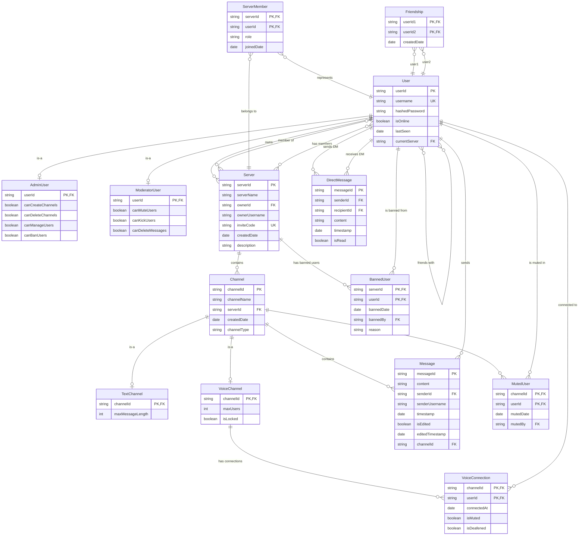

# Discord Clone - Entity Relationship Diagram

This document contains the Entity Relationship Diagram for the Discord Clone project, showing the data model and relationships between different entities.

## ER Diagram

## Entity Descriptions

### Core Entities

#### User
- **Primary Entity**: Represents all users in the system
- **Key Attributes**: userId (PK), username (unique), hashedPassword
- **Relationships**: Can own servers, be members of servers, send messages

#### Server
- **Purpose**: Represents Discord-like servers/guilds
- **Key Attributes**: serverId (PK), serverName, ownerId, inviteCode (unique)
- **Relationships**: Owned by one user, contains multiple channels, has multiple members

#### Channel (Abstract)
- **Purpose**: Base entity for all channel types
- **Key Attributes**: channelId (PK), channelName, serverId, channelType
- **Specializations**: TextChannel, VoiceChannel

#### Message
- **Purpose**: Represents messages sent in channels
- **Key Attributes**: messageId (PK), content, senderId, channelId, timestamp
- **Relationships**: Belongs to one channel, sent by one user

### Specialized Entities

#### AdminUser / ModeratorUser
- **Purpose**: User specializations with specific permissions
- **Inheritance**: Extends User entity
- **Key Attributes**: Permission flags specific to role

#### TextChannel / VoiceChannel
- **Purpose**: Channel specializations with type-specific features
- **Inheritance**: Extends Channel entity
- **Key Attributes**: Type-specific properties (maxMessageLength, maxUsers)

### Association Entities

#### ServerMember
- **Purpose**: Many-to-many relationship between Users and Servers
- **Key Attributes**: serverId (FK), userId (FK), role, joinedDate
- **Purpose**: Tracks user membership and roles in servers

#### Friendship
- **Purpose**: Many-to-many self-relationship for User friends
- **Key Attributes**: userId1 (FK), userId2 (FK), createdDate
- **Purpose**: Represents friendship connections between users

### Moderation Entities

#### MutedUser
- **Purpose**: Tracks users muted in specific channels
- **Key Attributes**: channelId (FK), userId (FK), mutedDate, mutedBy (FK)

#### BannedUser
- **Purpose**: Tracks users banned from specific servers
- **Key Attributes**: serverId (FK), userId (FK), bannedDate, bannedBy (FK)

#### VoiceConnection
- **Purpose**: Tracks users connected to voice channels
- **Key Attributes**: channelId (FK), userId (FK), connectedAt, isMuted, isDeafened

## Relationship Types

### One-to-Many (1:N)
- User → Server (ownership)
- Server → Channel
- Channel → Message
- User → Message (authorship)

### Many-to-Many (M:N)
- User ↔ Server (membership) - via ServerMember
- User ↔ User (friendship) - via Friendship

### Inheritance (IS-A)
- AdminUser IS-A User
- ModeratorUser IS-A User
- TextChannel IS-A Channel
- VoiceChannel IS-A Channel

### Composition (HAS-A)
- Server HAS-A collection of Channels
- Channel HAS-A collection of Messages
- User HAS-A collection of Friends

## Key Design Features

1. **Inheritance Hierarchy**: Clear IS-A relationships for users and channels
2. **Polymorphism Support**: Base classes allow polymorphic behavior
3. **Flexible Permissions**: Role-based access control through user types
4. **Audit Trail**: Timestamps and creator tracking for moderation
5. **Scalable Design**: Separate entities for different concerns
6. **Data Integrity**: Foreign key relationships maintain consistency

This ER diagram represents the logical data model that supports all the OOP principles demonstrated in the Discord Clone implementation.
